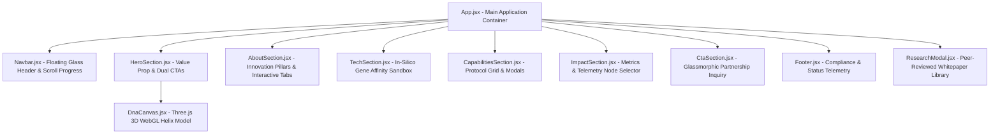

# 🧬 AURA GENOMICS — Synthetic Biology & Genomic Intelligence

A premium, animation-driven biotechnology landing page built with **React**, **Vite**, **Three.js WebGL**, **Tailwind CSS v4**, and **Lucide React**.

Designed to showcase next-generation CRISPR 3.0 cellular engineering, quantum protein folding, targeted mRNA nanoparticle therapeutics, and automated robotic bio-foundry operations.

---

## 🌟 Live Demo & Preview

- **Interactive 3D Helix Model**: Real-time rotating DNA double helix rendered via Three.js with custom lighting, nucleotide base pairs, particle fields, speed control sliders, and color palette presets.
- **In-Silico Gene Sandbox**: Interactive RNA sequence alignment and thermodynamic folding simulator.
- **Scientific Innovation Pillars**: Interactive timeline breakdown of computational biology techniques.
- **Core Biotech Capabilities Suite**: Service cards with interactive detail protocol drawers.
- **Global Impact & Telemetry Network**: Real-time node monitoring across international bio-foundries.
- **Glassmorphic Partnership Portal**: Contact & trial request form with instant celebration feedback.

---

## 📐 Architecture & Workflow



---

## 🎨 Design & Animation Approach

### 1. Aesthetic Identity
- **Futuristic Biotech Dark Theme**: Dark slate background (`#030712`) enriched with HSL glow radial gradients in Midnight Cyan (`#06b6d4`), Bio-Emerald (`#10b981`), Cyber Violet (`#8b5cf6`), and Amber (`#f59e0b`).
- **Glassmorphism & Micro-Interactions**: Multi-layered cards utilizing `backdrop-filter: blur(16px)`, translucent 1px borders, subtle hover elevations, and scanline overlay effects.
- **Modern Typography**: Google Fonts (`Outfit` for high-impact headers, `Plus Jakarta Sans` for sleek body, `JetBrains Mono` for genetic sequence data and telemetry).

### 2. 3D WebGL Canvas & Physics
- Built using **Three.js** inside `DnaCanvas.jsx`.
- Features 36 double-helix base pairs with cylinder rungs and glowing nucleotide spheres.
- Includes dynamic lighting (PointLights in Cyan, Emerald, Violet), inertia mouse-drag rotation tracking, and customizable color modes (Cyan-Emerald, Violet, Amber).

### 3. Interactive Gene Sandbox
- Users can input or select target RNA sequences (e.g., `AUG-CCC-GUA-UAC-GGG-AAC-UGA`).
- Dynamic sliders allow real-time tuning of Target Binding Affinity (%) and Codon Optimization Scores.
- Calculates predicted protein yield, free energy ($\Delta G$), toxicity, and half-life with visual console output and celebratory confetti.

---

## 🚀 Getting Started & Usage Guide

### Prerequisites
- **Node.js** (v18.0.0 or higher recommended)
- **npm** (v9.0.0 or higher)

### Installation
1. Clone or navigate to the project directory:
   ```bash
   cd React_bio
   ```

2. Install dependencies:
   ```bash
   npm install
   ```

3. Start the development server:
   ```bash
   npm run dev
   ```
   Open your browser at `http://localhost:5173`.

### Production Build & Preview
To build the application for deployment:
```bash
npm run build
```

To locally preview the built production bundle:
```bash
npm run preview
```

---

## 🛠️ Technology Stack

| Technology | Purpose |
| :--- | :--- |
| **React 18** | UI component architecture and state management |
| **Vite 8** | Fast module bundling and dev environment |
| **Three.js** | 3D WebGL double helix rendering & particle animation |
| **Tailwind CSS v4** | Utility-first responsive styling and layout |
| **Lucide React** | Modern biotechnology, scientific, and UI icon set |
| **Canvas Confetti** | Interactive simulation celebration feedback |

---

## 🛡️ Accessibility & Responsiveness
- **Fully Responsive**: Optimized viewports for mobile phones (320px+), tablets, laptops, and ultra-wide displays.
- **High Contrast**: Compliant text contrast ratios over dark glassmorphic cards.
- **Keyboard Navigation**: Interactive buttons and focus outlines across all interactive elements.

---

## 📜 License
Developed for **AURA GENOMICS** — Synthetic Biology & Genomic Intelligence.
